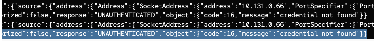

# Securing ML Models with RHOAI Serving Runtime and Authorino

Securing machine learning (ML) models is essential to protect sensitive data and ensure reliable performance. ML models often handle confidential and proprietary information, making them targets for data breaches and unauthorized access. 

Without proper security, these models are vulnerable to tampering and exploitation, which can lead to incorrect predictions, data leaks, and a loss of trust from users and stakeholders.

This demo shows how to secure a Model Server deployed with RHOAI Serving Runtime using Authorino.

Securing the inference endpoint with token authorization (using [Authorino](https://github.com/kuadrant/authorino)) means that a Bearer Token must be included in the request headers to access the model. Without this token, any request will result in a 401 Unauthorized error. This security measure ensures that only authenticated users can interact with the model, preventing unauthorized access and misuse of resources, and maintaining the integrity and trustworthiness of the model.

For more information check the [RHOAI Serving Runtime documentation - Installing Authorino Operator](https://docs.redhat.com/en/documentation/red_hat_openshift_ai_self-managed/2.10/html/serving_models/serving-large-models_serving-large-models#installing-the-authorino-operator_serving-large-models).

## Table of Contents
- [Securing ML Models with RHOAI Serving Runtime and Authorino](#securing-ml-models-with-rhoai-serving-runtime-and-authorino)
  - [1. Install RHOAI, Authorino, and other Operators required](#1-install-rhoai-authorino-and-other-operators-required)
  - [2. Deploy and Secure the Model Server](#2-deploy-and-secure-the-model-server)
  - [3. Testing the Model Server (Curl) deployed with Authentication Enabled using Authorino](#3-testing-the-model-server-curl-deployed-with-authentication-enabled-using-authorino)
    - [3.1 Getting the Bearer Token](#31-getting-the-bearer-token)
    - [3.1.1 Testing the Model Server **with the Bearer Token**](#311-testing-the-model-server-with-the-bearer-token)
    - [3.2 Testing the Model Server **without Bearer Token**](#32-testing-the-model-server-without-bearer-token)
  - [4. Testing the Model Server (Jupyter Notebook) deployed with Authentication Enabled using Authorino](#4-testing-the-model-server-jupyter-notebook-deployed-with-authentication-enabled-using-authorino)
  - [5. Rotating the Bearer Token](#5-rotating-the-bearer-token)
  - [6. Links of Interest](#5-links-of-interest)

## 1. Install RHOAI, Authorino, and other Operators required

> IMPORTANT: These demo is assuming that you have not RHOAI nor Authorino installed, just a plain OpenShift cluster from scratch (with a GPU node optionally).

* Install the RHOAI Operators required (including Authorino):

```bash
kubectl apply -k rhoai-secured/overlays/operators/
```

* Configure RHOAI, NFD, and Nvidia Instances:

```bash
kubectl apply -k rhoai-secured/overlays/instances/
```

* (Optional) Deploy GPU Instances if you don't have them:

```bash
bash rhoai-secured/overlays/demo-prep/gpu-machineset.sh
```

* Configure Demo Requirements:

```bash
kubectl apply -k rhoai-secured/overlays/demo-prep
```

> NOTE: This is executed and prepared with yaml-based but everything can be done with the OpenShift and OpenShift AI UI Console as well.

## 2. Deploy and Secure the Model Server

We will use RHOAI Serving Runtime to deploy the Model Server and Authorino to secure the inference endpoint.

* Clone the repository in the Workbench (TensorFlow image) and run the 1_download_save.ipynb notebook to download the model and save it in s3.

> NOTE: We will use the `llama3` model in this demo, but you can use any other compatible model.

* Deploy the Model Server with the RHOAI Serving Runtime:

```bash
kubectl apply -f demo/inference_service.yaml
```

> NOTE: We will use the Out of the Box vLLM KServe Model Server in this demo, but you can use any other compatible model server.

## 3. Testing the Model Server (Curl) deployed with Authentication Enabled using Authorino

Because we secured the inference endpoint of our server by enabling token authorization, 
we must provide a Bearer Token in the request headers to access the endpoint.

### 3.1 Getting the Bearer Token

In the RHOAI Dashboard check the Token Secret below in your Model Server section:


If you want to have more information around getting the Bearer Token check [the official RHOAI Serving Runtime docs](https://docs.redhat.com/en/documentation/red_hat_openshift_ai_self-managed/2.10/html/serving_models/serving-large-models_serving-large-models#accessing-authorization-token-for-deployed-model_serving-large-models).

### 3.1.1 Testing the Model Server **with the Bearer Token**

* If we try to access the Model Server URL with the Bearer Token, we will get a 200 OK response:

```bash
token="xxxx"
$infer_url="https://llama3-demo-rhoai-secured.apps.cluster-xxx.xxx.xxx.xxx.com/v1/completions"
```

* Run the following command to test the Model Server with the Bearer Token (-H "Authorization: Bearer $token):

```md
curl -vk $infer_url \
    -H "Authorization: Bearer $token" \
    -H "Content-Type: application/json" \
    -d '{
          "model": "llama3",
          "prompt": "What is Kubernetes?",
          "max_tokens": 128,
          "temperature": 1,
          "top_p": 1,
          "n": 1,
          "stream": false,
          "logprobs": 0,
          "echo": false,
          "stop": ["string"],
          "presence_penalty": 0,
          "frequency_penalty": 0,
          "best_of": 1,
          "user": "string",
          "top_k": -1,
          "ignore_eos": false,
          "use_beam_search": false,
          "stop_token_ids": [0],
          "skip_special_tokens": true,
          "spaces_between_special_tokens": true,
          "repetition_penalty": 1,
          "min_p": 0,
          "include_stop_str_in_output": false,
          "length_penalty": 1
      }' 2>&1
      
* Host llama3-demo-rhoai-secured.apps.cluster-xxx.xxx.xxx.xxx.com:443 was resolved.
...
* [HTTP/2] [1] OPENED stream for https://llama3-demo-rhoai-secured.apps.cluster-xxx.xxx.xxx.opentlc.com/v1/completions
* [HTTP/2] [1] [:method: POST]
* [HTTP/2] [1] [:scheme: https]
* [HTTP/2] [1] [:authority: llama3-demo-rhoai-secured.apps.cluster-xxx.xxx.xxx.xxx.com]
* [HTTP/2] [1] [:path: /v1/completions]
* [HTTP/2] [1] [user-agent: curl/8.6.0]
* [HTTP/2] [1] [accept: */*]
* [HTTP/2] [1] [authorization: Bearer xxx]
* [HTTP/2] [1] [content-type: application/json]
* [HTTP/2] [1] [content-length: 749]
> POST /v1/completions HTTP/2
> Host: llama3-demo-rhoai-secured.apps.cluster-xxx.xxx.xxx.xxx.com
> User-Agent: curl/8.6.0
> Accept: */*
> Authorization: Bearer 
> Content-Type: application/json
> Content-Length: 749
> 
< HTTP/2 200 
< content-length: 5318
< content-type: application/json
< date: Mon, 08 Jul 2024 21:25:57 GMT
< server: istio-envoy
< x-envoy-upstream-service-time: 4464
< 
{"id":"cmpl-7b5df697f06344ff8c01876fddca973d",
"object": "text_completion",
"created":1720473958,
"model":"llama3",
"choices":
[{"index":0,"text":" Kubernetes, often abbreviated as “K8s”,..."}]}
```

* In the Authorino pod in `redhat-ods-applications-auth-provider` namespace, check the logs:


```json
{
  "level": "info",
  "ts": "2024-07-08T21:25:58Z",
  "logger": "authorino.service.auth",
  "msg": "outgoing authorization response",
  "request id": "a0d426ef-f449-4bb8-a8fd-4935fad5ad56",
  "authorized": true,
  "response": "OK"
}
```

* As we can see, the request was authorized (200) because the Bearer Token was provided.

### 3.2 Testing the Model Server **without Bearer Token**

* If we try to access the Model Server URL without the Bearer Token, we will get a 401 Unauthorized error:

```md
curl -vk $infer_url \
    -H "Content-Type: application/json" \
    -d '{
          "model": "llama3",
          "prompt": "What is Kubernetes?",
          "max_tokens": 512,
          "temperature": 1,
          "top_p": 1,
          "n": 1,
          "stream": false,
          "logprobs": 0,
          "echo": false,
          "stop": ["string"],
          "presence_penalty": 0,
          "frequency_penalty": 0,
          "best_of": 1,
          "user": "string",
          "top_k": -1,
          "ignore_eos": false,
          "use_beam_search": false,
          "stop_token_ids": [0],
          "skip_special_tokens": true,
          "spaces_between_special_tokens": true,
          "repetition_penalty": 1,
          "min_p": 0,
          "include_stop_str_in_output": false,
          "length_penalty": 1
      }'
* Host llama3-demo-rhoai-secured.apps.cluster-h7kc2.h7kc2.xxxx.xxx.com:443 was resolved.
...
* Connected to llama3-demo-rhoai-secured.apps.cluster-h7kc2.h7kc2.xxx.xxx.com (xx.xx.162.191) port 443
* ALPN: curl offers h2,http/1.1
...
* [HTTP/2] [1] OPENED stream for https://llama3-demo-rhoai-secured.apps.cluster-xxx.xxx.xxx.xxx.com/v1/completions
* [HTTP/2] [1] [:method: POST]
* [HTTP/2] [1] [:scheme: https]
* [HTTP/2] [1] [:authority: llama3-demo-rhoai-secured.apps.cluster-xxx.xxx.xxx.xxx.com]
* [HTTP/2] [1] [:path: /v1/completions]
* [HTTP/2] [1] [user-agent: curl/8.6.0]
* [HTTP/2] [1] [accept: */*]
* [HTTP/2] [1] [content-type: application/json]
* [HTTP/2] [1] [content-length: 70]
> POST /v1/completions HTTP/2
> Host: llama3-demo-rhoai-secured.apps.cluster-xxx.xxx.xxx.xxx.com
> User-Agent: curl/8.6.0
> Accept: */*
> Content-Type: application/json
> Content-Length: 70
> 
< HTTP/2 401 
< content-length: 0
< date: Mon, 08 Jul 2024 20:47:05 GMT
< server: istio-envoy
< www-authenticate: Bearer realm="kubernetes-user"
< x-envoy-upstream-service-time: 6
< x-ext-auth-reason: credential not found
< 
```

* In the Authorino pod in `redhat-ods-applications-auth-provider` namespace, check the logs:



```json
{
  "level": "info",
  "logger": "authorino.service.auth",
  "msg": "outgoing authorization response",
  "request id": "66a4b1e2-4087-4edd-8bc0-f84bcb9ed263",
  "authorized": false,
  "response": "UNAUTHENTICATED",
  "object": {
    "code": 16,
    "message": "credential not found"
  }
}
```

As we can see, the request was unauthorized (401) because the Bearer Token was not provided.

## 4. Testing the Model Server (Jupyter Notebook) deployed with Authentication Enabled using Authorino

* Open the Jupyter Notebook in the Workbench and run the [`rest_requests.ipynb` notebook](./demo/2_rest_requests.ipynb) in the demo folder to test the Model Server with and without the Bearer Token.

## 5. Rotating the Bearer Token

* To rotate the Bearer Token, you can rotate the Token inside of the Secret that Authorino and RHOAI creates alongside with Inference Service:

```bash
NEW_TOKEN="xxx"
TOKEN_NAME="llama3auth"
NAMESPACE="demo-rhoai-secured"
MODEL_SERVER="llama3"

kubectl patch secret $TOKEN_NAME-$MODEL_SERVER-sa -n $NAMESPACE --type='json' -p='[{"op": "replace", "path": "/data/token", "value": "'"$(echo -n $NEW_TOKEN | base64)"'"}]'
```

The token is stored in the `token` key of the Secret in base64 format. The command above will replace the current token with the new one.

> NOTE: the NEW_TOKEN is the new API Key you want to use, but needs to have the same format/length as the previous one. Check the[Authorino documentation Api Key](https://github.com/Kuadrant/authorino/blob/main/docs/features.md#api-key-authenticationapikey) for more information.

## 6. Links of Interest

* [Simplify API security with Authorino](https://developers.redhat.com/articles/2021/06/18/authorino-making-open-source-cloud-native-api-security-simple-and-flexible#a_use_case_for_authorino)
* [Authorino Documentation](https://github.com/Kuadrant/authorino/blob/main/docs/README.md)